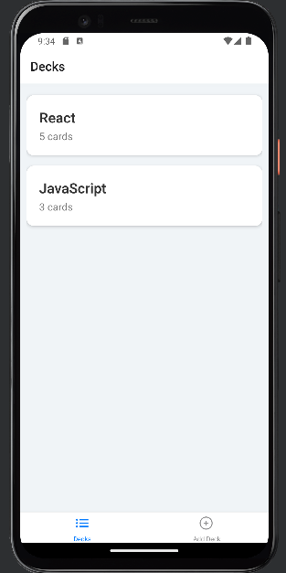
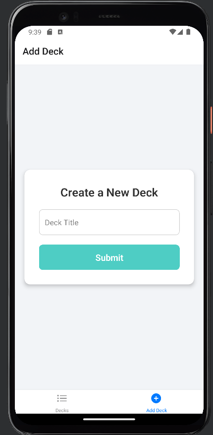
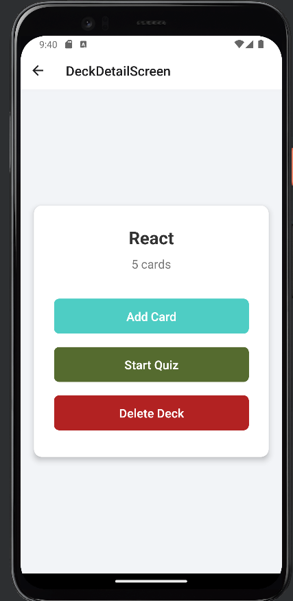
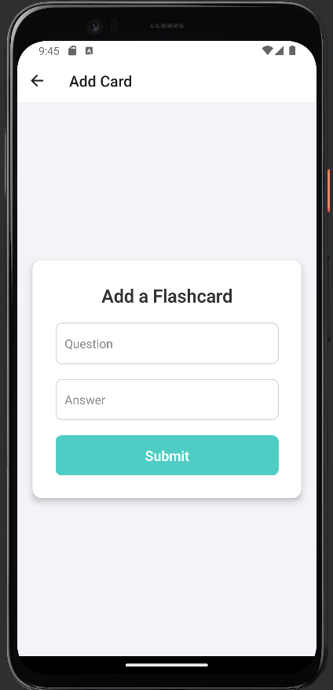
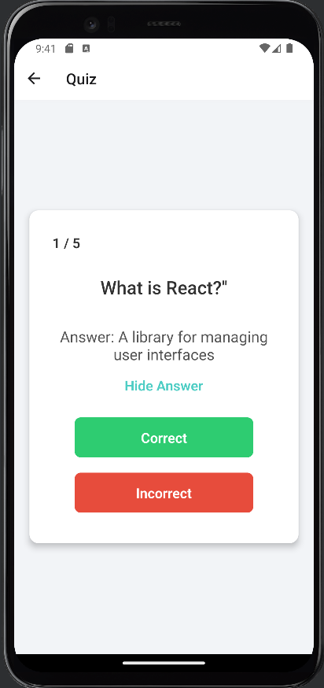
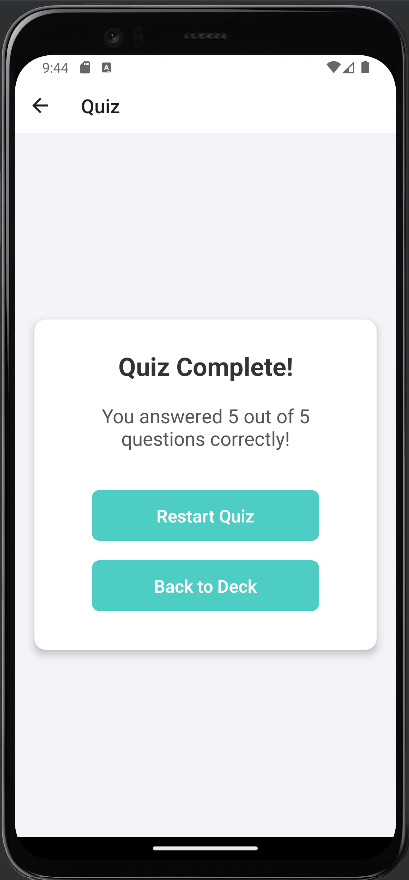

# Mobile Flashcards App

A mobile application built with React Native that allows users to create, manage, and quiz themselves on flashcards. Whether you're studying for an exam or learning a new language, this app provides a seamless experience to enhance your learning process.

## Table of Contents

- [Mobile Flashcards App](#mobile-flashcards-app)
  - [Table of Contents](#table-of-contents)
  - [Features](#features)
  - [Screenshots](#screenshots)
    - [Home Screen - All Decks](#home-screen---all-decks)
    - [Add a New Deck](#add-a-new-deck)
    - [Deck Details](#deck-details)
    - [Add a Flashcard](#add-a-flashcard)
    - [Quiz Mode](#quiz-mode)
    - [Quiz Results](#quiz-results)
  - [Installation](#installation)
  - [Usage](#usage)
  - [Technologies Used](#technologies-used)
  - [Project Structure](#project-structure)
  - [Contributing](#contributing)
  - [License](#license)

## Features

- **Create Decks:** Organize your flashcards into different decks based on subjects or topics.
- **Add Flashcards:** Easily add questions and answers to each deck.
- **Quiz Mode:** Test your knowledge with interactive quizzes, tracking your progress and scores.
- **Deck Management:** View all your decks, see the number of cards in each, and delete decks when needed.
- **Persistent Storage:** All your data is saved locally using AsyncStorage, ensuring your information is retained between sessions.
- **User-Friendly Interface:** Clean and intuitive UI designed for a smooth user experience.
- **Notifications:** Receive reminders to study and keep your learning on track.

## Screenshots

### Home Screen - All Decks



### Add a New Deck



### Deck Details



### Add a Flashcard



### Quiz Mode



### Quiz Results



> **Note:** Replace the placeholder image paths (`./screenshots/*.png`) with the actual paths to your screenshots in the project directory.

## Installation

Follow these steps to set up the project locally:

1. **Clone the Repository**

   ```bash
   git clone https://github.com/yourusername/mobile-flashcards.git
   cd mobile-flashcards
   ```

2. **Install Dependencies**

   Ensure you have [Node.js](https://nodejs.org/) and [Expo CLI](https://docs.expo.dev/get-started/installation/) installed.

   ```bash
   npm install -g expo-cli
   npm install
   ```

3. **Run the Application**

   ```bash
   expo start
   ```

   This will start the development server. You can then use the Expo app on your mobile device or an emulator to view the application.

## Usage

1. **Create a New Deck**

   - Navigate to the "Add Deck" screen.
   - Enter a title for your new deck.
   - Submit to create the deck.

2. **Add Flashcards**

   - Select a deck from the "All Decks" screen.
   - Navigate to "Add Card" within the deck details.
   - Enter the question and answer for your flashcard.
   - Submit to add the card to the deck.

3. **Start a Quiz**

   - Select a deck you want to be quizzed on.
   - Tap "Start Quiz" to begin.
   - Answer each question by marking it as correct or incorrect.
   - View your results at the end of the quiz.

4. **Manage Decks**

   - From the deck details, you can delete a deck if it's no longer needed.

## Technologies Used

- **React Native:** Framework for building native mobile apps using React.
- **Redux & Redux Toolkit:** State management library for managing application state.
- **AsyncStorage:** Asynchronous, unencrypted, persistent, key-value storage system for React Native.
- **React Navigation:** Routing and navigation for your React Native apps.
- **UUID:** Library for generating unique identifiers.
- **Expo:** A platform for making universal native apps for Android, iOS, and the web with JavaScript and React.

## Project Structure

```
mobile-flashcards/
├── components/
│   ├── AddDeckScreen.js
│   ├── AddFlashCardScreen.js
│   ├── AllDecksScreen.js
│   ├── DeckDetailScreen.js
│   ├── NotificationScreen.js
│   ├── QuizResultScreen.js
│   └── QuizScreen.js
├── slices/
│   ├── decksSlice.js
│   ├── notificationsSlice.js
│   └── quizSlice.js
├── utils/
│   └── api.js
├── assets/
│   └── screenshots/
│       ├── all_decks.png
│       ├── add_deck.png
│       ├── deck_detail.png
│       ├── add_flashcard.png
│       ├── quiz_screen.png
│       ├── quiz_result.png
│       └── notification_screen.png
├── App.js
├── package.json
└── README.md
```

## License

This project is licensed under the [MIT License](LICENSE).

---
